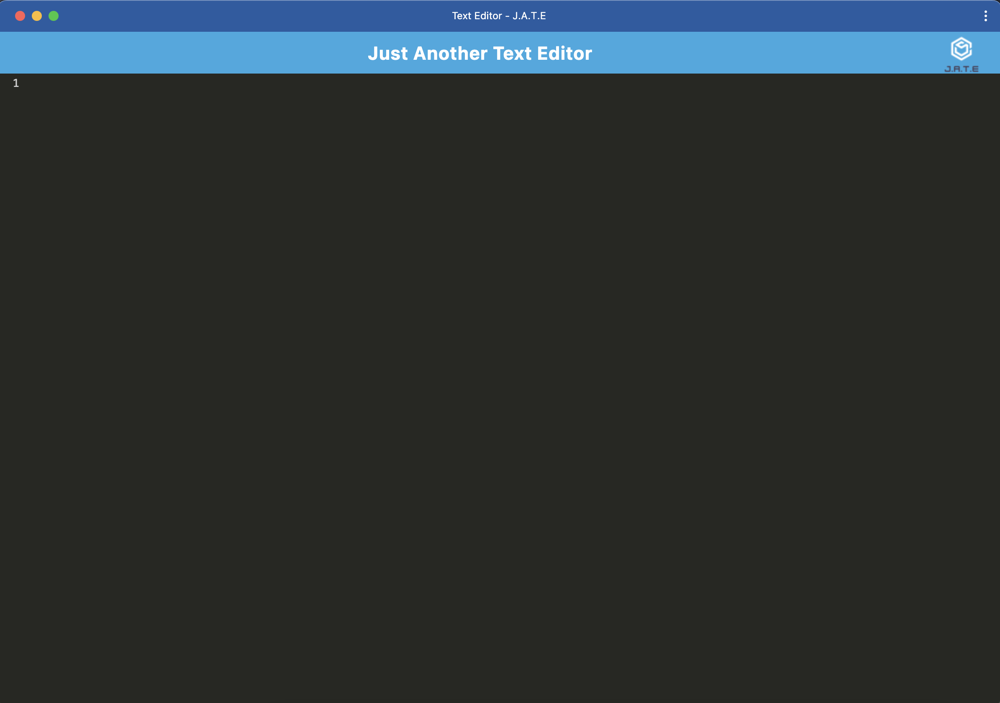

# Text Editor App

## Description

Text Editor App is a Progressive Web Application (PWA) that allows users to create notes or code snippets with or without an internet connection. The application uses a variety of data persistence techniques to ensure content is always saved and retrievable, providing a seamless user experience. This project is built using modern web technologies such as Webpack, Babel, IndexedDB, and Workbox.

## Table of Contents

- [Description](#description)
- [Features](#features)
- [Installation](#installation)
- [Usage](#usage)
- [Technologies Used](#technologies-used)
- [Deployment](#deployment)
- [Screenshots](#screenshots)
- [Contributing](#contributing)
- [License](#license)

## Features

- Create and save notes or code snippets
- Offline functionality
- Data persistence using IndexedDB
- Service worker for offline support
- Installable as a PWA
- Responsive design

## Installation

1. Clone the repository:
   \`\`\`bash
   git clone https://github.com/SpencerKlink/Text-Editor-App.git
   \`\`\`
2. Navigate to the project directory:
   \`\`\`bash
   cd Text-Editor-App
   \`\`\`
3. Install dependencies for both client and server:
   \`\`\`bash
   npm install
   cd client && npm install
   cd ../server && npm install
   \`\`\`
4. Build the client:
   \`\`\`bash
   cd ../client && npm run build
   \`\`\`

## Usage

1. Start the server:
   \`\`\`bash
   cd ../server
   node server.js
   \`\`\`
2. Open your web browser and navigate to \`http://localhost:3000\`.

## Technologies Used

- **Frontend**:
  - HTML
  - CSS
  - JavaScript
  - Webpack
  - Babel
  - IndexedDB
  - Workbox

- **Backend**:
  - Node.js
  - Express

## Deployment

The application can be deployed on platforms such as Render. Follow these steps to deploy:

1. **Push Your Code to GitHub**:
   \`\`\`bash
   git add .
   git commit -m "Initial commit"
   git push -u origin master
   \`\`\`
2. **Create a New Web Service on Render**:
   - Connect your GitHub repository
   - Set the build command: \`npm install && cd client && npm install && npm run build && cd ../server && npm install\`
   - Set the start command: \`node server/server.js\`
   - Deploy the service

## Screenshots

## Contributing

Contributions are welcome! Please fork this repository and submit a pull request for any features, bug fixes, or enhancements.

## License

This project is licensed under the MIT License. 
